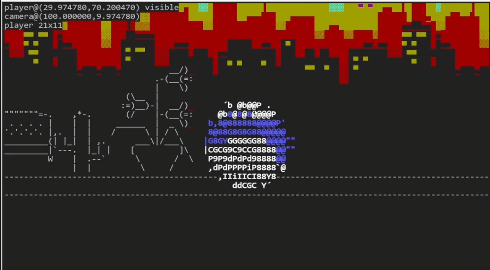

# Katamascii

This is a WIP prototype for a terminal puzzle game where you roll around collecting
ASCII art objects. Like the beloved video game Katamari Damacy, but entirely
in your terminal window.

I'm still trying to flesh out the ideas, I'm not sure if it will work yet!

The idea will be you will collect object to attach to yourself to solve physics
puzzles, and as you grow so will the scale of the objects, taking you to the
next level.

## Video

See a video [here](https://twitter.com/taviso/status/1513332576185827331).

## Current Status

I'm trying to get the physics working and translate them into ncurses.

You can run the demo if you like, the arrow keys control your rolling.

The code is very hacky, I'm just experimenting.

## Building

Just type `make`, I was using Ubuntu 20.04.4. You need `libglib2.0-dev`,
`chipmunk-dev`, `libncurses-dev` and `libcaca-dev`.

### Keys

| Key     | Description  |
| ------- | ------------ |
| F1      | Exit         |
| F3      | Spawn Object |
| F4      | Spawn Coins  |
| Arrows  | Roll / Jump  |

## License

I dunno lol, GPL3?

### Artwork

I used a bunch of random ASCII/ANSI art I found online, I have the original
URLs in my NOTES. FIXME: Add full credit.
